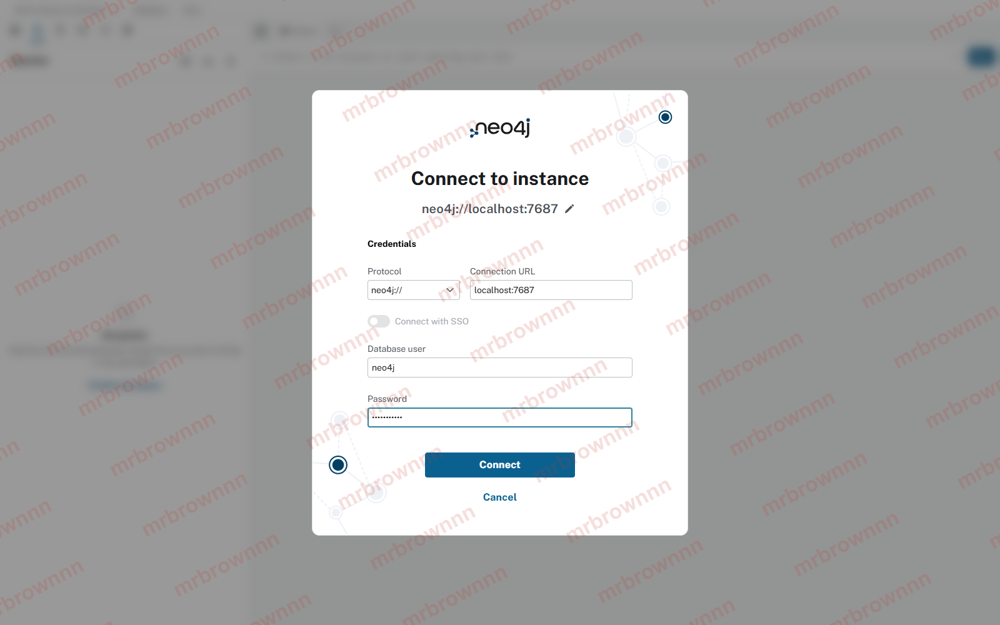
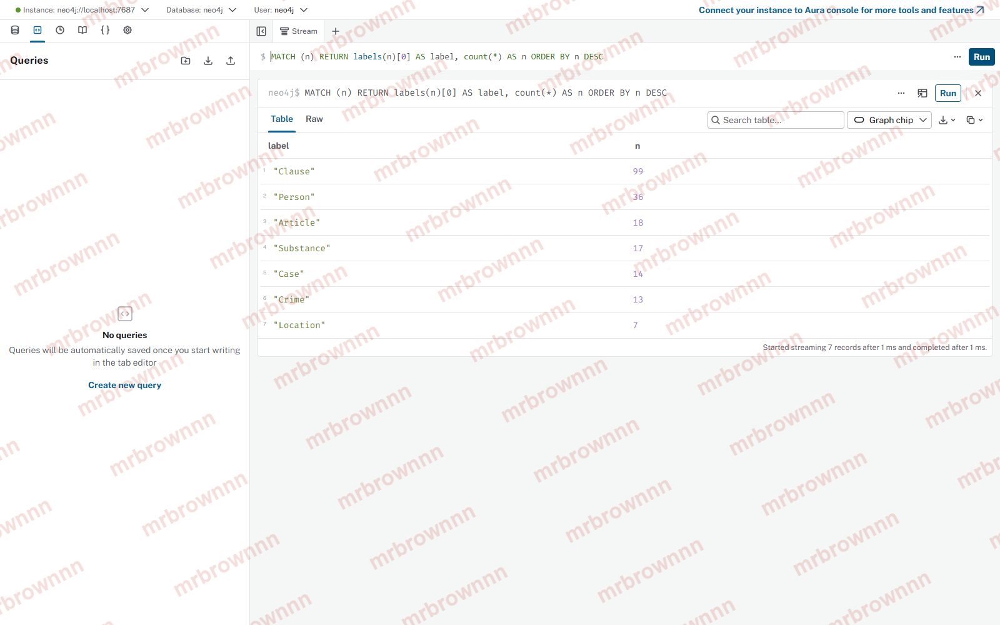
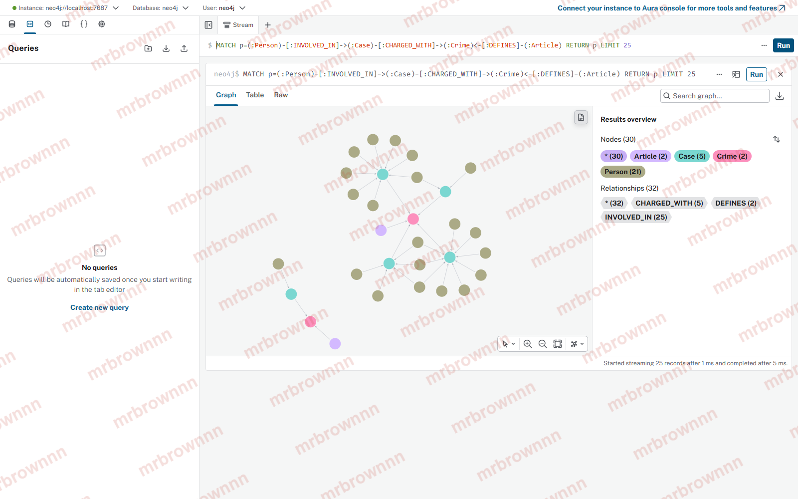
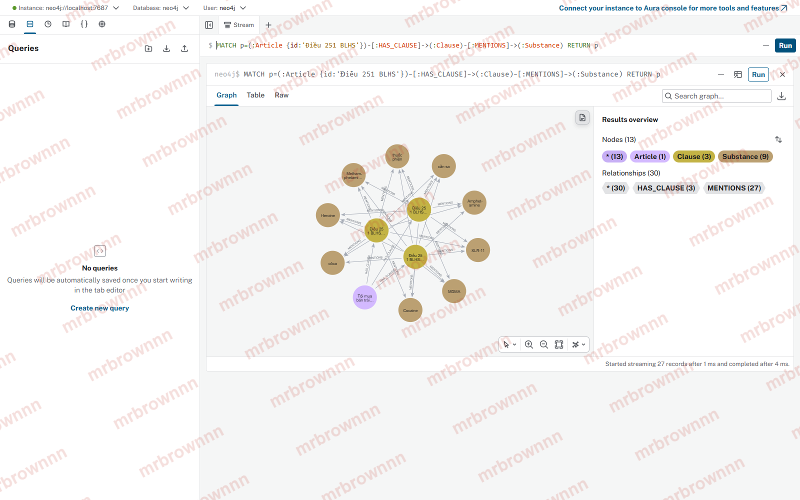
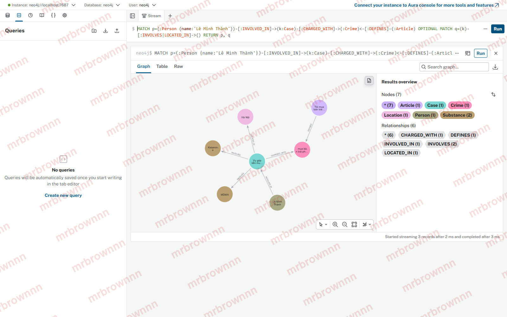

# Lab Guide — Day 19 Knowledge Graph

Làm **đúng thứ tự**. Mỗi bước có **lệnh kiểm tra** và **dấu hiệu xong**. Chưa đạt dấu hiệu xong thì chưa sang bước sau. Gặp lỗi thì xem [Xử lý lỗi](#xử-lý-lỗi) ở cuối file.

| Bước | Việc | Thời gian |
| --- | --- | --- |
| 0 | Setup môi trường + Neo4j | 20' |
| 1 | Làm quen dữ liệu và graph | 15' |
| 2 | KG-1 `link_crime` | 15' |
| 3 | KG-2 `parse_law_article` | 30' |
| 4 | KG-3 `GraphRAGAgent.answer` | 15' |
| 5 | KG-4 Cypher hop xuyên KB | 45' |
| 6 | Chạy benchmark | 10' |
| 7 | Xem graph, chụp ảnh, tìm lỗi | 50' |
| 8 | Viết báo cáo, nộp bài | 40' |

---

## Bước 0 — Setup

**Cần có:** Python 3.11, Docker Desktop (đang chạy), OpenAI API key.

```bash
# 1. Môi trường Python
py -3.11 -m venv .venv            # macOS/Linux: python3.11 -m venv .venv
.venv\Scripts\activate             # macOS/Linux: source .venv/bin/activate
pip install -r requirements.txt

# 2. Neo4j. Chỉ chạy lệnh này lần đầu; các lần sau dùng: docker start neo4j-drug-kg
docker run -d --name neo4j-drug-kg -p 7474:7474 -p 7687:7687 -e NEO4J_AUTH=neo4j/password123 neo4j:5

# 3. API key
copy .env.example .env             # macOS/Linux: cp .env.example .env
#    mở .env, điền OPENAI_API_KEY=sk-...
```

Trên Windows, đặt UTF-8 cho terminal trước khi chạy Python để không lỗi tiếng Việt:

```powershell
$env:PYTHONIOENCODING="utf-8"      # Git Bash: export PYTHONIOENCODING=utf-8
```

**Kiểm tra:**

```bash
docker ps                          # thấy neo4j-drug-kg, STATUS = Up
pytest tests/test_base.py -q       # base RAG có sẵn
```

**Dấu hiệu xong:**
- `pytest` báo `41 passed`.
- Mở http://localhost:7474, đăng nhập `neo4j` / `password123`, thấy giao diện Neo4j Browser.

> `.env` đã nằm trong `.gitignore`. **Không bao giờ** commit `.env` hay dán API key vào code hoặc báo cáo.

---

## Bước 1 — Làm quen dữ liệu và graph

Chưa code gì. Mở và đọc:

1. `data/drug_law/blhs-dieu-251.md`: một Điều luật. Để ý cấu trúc: tiêu đề `Điều 251. Tội …`; các khoản `1.`, `2.`…; mỗi khoản có câu "thì bị phạt tù từ … đến …"; các điểm `a)`, `b)` nêu tên chất và khối lượng; chú thích dạng `[2]`.
2. Hai hoặc ba bài bất kỳ trong `data/drug_news/`. Để ý: tội danh được viết thế nào, có thống nhất không?
3. `data/benchmark_kg.json`: 6 câu hỏi. Với mỗi câu, tự đoán trước: cần dữ liệu từ KB nào? Flat RAG có lấy đủ được không?
4. `src/graph.py`: đọc docstring đầu file (schema), `NEWS_EXTRACTION_PROMPT`, và các hàm `Neo4jGraph.add_law_article` / `add_news_case` để hiểu node và cạnh được tạo ra thế nào.

**Dấu hiệu xong:** bạn trả lời được "node nào nối 2 KB với nhau, và nó bị gãy khi nào?". Ghi câu trả lời lại; mục 3 của báo cáo sẽ cần.

---

## Bước 2 — KG-1 `link_crime`

**Vấn đề:** LLM đọc tin tức sẽ ghi tội danh theo cách của báo, ví dụ `"Tội Mua bán trái phép chất ma tuý"`. Luật lại định nghĩa tội là `"mua bán trái phép chất ma túy"`. Hai chuỗi này lệch nhau ở chữ hoa, tiền tố "Tội", và cách bỏ dấu `tuý`/`túy`. Không khớp thì `Case` không nối được sang `Article`.

**Yêu cầu:** `link_crime(charge, known_crimes)` trả về **đúng một** phần tử trong `known_crimes`, hoặc `None`.

**Gợi ý:**
- Dùng `normalize_crime()` có sẵn.
- Khớp chính xác thì trả về ngay.
- Không khớp chính xác thì dùng `difflib.get_close_matches(x, known_crimes, n=1, cutoff=0.8)` (thư viện chuẩn).
- Không đủ giống thì trả `None`. **Đừng đoán bừa**: nối sai sang tội khác còn tệ hơn không nối.

**Kiểm tra:** `pytest tests/test_graph.py -k LinkCrime -v`

**Dấu hiệu xong:** `3 passed`

---

## Bước 3 — KG-2 `parse_law_article`

**Vấn đề:** cần biến một file Điều luật thành dữ liệu có cấu trúc để đưa vào graph. Văn bản luật rất đều nên **dùng regex, không cần LLM**: rẻ, nhanh, và cho cùng kết quả mỗi lần chạy.

**Kết quả cần trả về** (xem thêm comment TODO trong code):

```python
{
  "id": "Điều 251 BLHS",                 # doc.metadata["article"]
  "law": "BLHS",                         # doc.metadata["law"]
  "title": "Tội mua bán trái phép chất ma túy",   # phần sau "Điều 251 BLHS. " trong metadata["title"]
  "doc_id": "blhs-dieu-251",
  "crime": "mua bán trái phép chất ma túy",       # normalize_crime(title) nếu title bắt đầu bằng "Tội ", ngược lại None
  "clauses": [
    {"id": "Điều 251 BLHS khoản 1", "number": 1,
     "penalty": "phạt tù từ 02 năm đến 07 năm",   # phần sau chữ "bị " trên DÒNG ĐẦU của khoản, bỏ ":" hoặc "." cuối
     "text": "1. Người nào …",                    # toàn bộ khoản
     "substances": [...]},                        # find_substances(text)
    ...
  ],
}
```

**Gợi ý:**
- Xóa chú thích trước: `FOOTNOTE.sub("", doc.content)`.
- `CLAUSE_START.finditer(body)` cho vị trí bắt đầu mỗi khoản. Khoản thứ i kéo dài tới chỗ bắt đầu khoản i+1, khoản cuối kéo tới hết văn bản.
- Điều của Luật PCMT (ví dụ Điều 2 "Giải thích từ ngữ") không định nghĩa tội, nên `crime` là `None`.

**Kiểm tra:** `pytest tests/test_graph.py -k ParseLawArticle -v`

**Dấu hiệu xong:** `5 passed`

---

## Bước 4 — KG-3 `GraphRAGAgent.answer`

**Yêu cầu:** giống `KnowledgeBaseAgent.answer` trong `src/agent.py`, thêm một bước dùng graph:

1. `chunks = self.store.search(question, top_k=top_k)`: giống hệt Flat RAG.
2. Lấy danh sách `doc_id` (không trùng) từ `chunk["metadata"]["doc_id"]`.
3. `facts = self.graph.context(question, doc_ids)`.
4. Điền `GRAPH_PROMPT` với `facts` (mỗi dòng một dữ kiện, bắt đầu bằng `- `), `chunks` (đánh số `[1]`, `[2]`…) và `question`.
5. `return self.llm_fn(prompt)`.

> Vì sao vẫn dùng vector search? Để GraphRAG **không bao giờ kém hơn** Flat RAG về ngữ cảnh. Graph chỉ thêm vào, không thay thế.

**Kiểm tra:** `pytest tests/test_graph.py -k GraphRAGAgent -v`

**Dấu hiệu xong:** `1 passed`. Chạy `pytest tests/ -q` ra `50 passed`.

---

## Bước 5 — KG-4 Cypher hop xuyên KB

Đây là phần chính của lab. `Neo4jGraph.context()` đã có sẵn bước tìm node hạt giống (seed) và lấy hàng xóm 1 bước. Bạn viết đoạn đi **từ vụ án sang luật**.

**Yêu cầu:** với mỗi `Case` trong `case_ids`, đi theo đường:

```
(Case)-[:CHARGED_WITH]->(Crime)<-[:DEFINES]-(Article)-[:HAS_CLAUSE]->(Clause)
```

Chỉ giữ lại:
- khoản 1 (khung cơ bản), **và**
- những khoản `MENTIONS` một `Substance` mà chính vụ đó `INVOLVES`.

Ngoài ra, nếu seed là chính một `Article` (câu hỏi nhắc thẳng "Điều 251"), lấy khoản 1 và các khoản nhắc tới chất có trong câu hỏi (`find_substances(question)`).

Mỗi khoản thêm 1 dòng vào `facts`:

```python
facts.append(f"[{article_id} - {title}] khoản {number}: {text}")
```

**Cách làm khuyến nghị:**

1. **Đưa dữ liệu vào graph trước.** `--check` sẽ báo lỗi ở KG-4, nhưng trước đó nó đã nạp toàn bộ luật và 1 vụ mẫu vào graph:

   ```bash
   python bench_kg.py --check
   ```

2. **Viết Cypher trong Neo4j Browser** (http://localhost:7474). Bắt đầu đơn giản rồi thêm điều kiện dần:

   ```cypher
   // a. Vụ mẫu có những cạnh nào?
   MATCH (k:Case)-[r]-(x) RETURN k, r, x;

   // b. Đi từ vụ sang Điều luật
   MATCH (k:Case)-[:CHARGED_WITH]->(c:Crime)<-[:DEFINES]-(a:Article) RETURN k.name, c.name, a.id;

   // c. Thêm khoản, rồi tự viết điều kiện lọc (khoản 1 HOẶC khoản nhắc chất của vụ)
   MATCH (k:Case)-[:CHARGED_WITH]->(:Crime)<-[:DEFINES]-(a:Article)-[:HAS_CLAUSE]->(cl:Clause)
   WHERE /* điều kiện của bạn */
   RETURN a.id, cl.number, cl.penalty;
   ```

   Gợi ý cú pháp: `EXISTS { (k)-[:INVOLVES]->(:Substance)<-[:MENTIONS]-(cl) }`; `UNION` để gộp 2 truy vấn; `elementId(k) IN $ids` để lọc theo tham số.

3. **Đưa vào Python:** `self.run(cypher, ids=case_ids, ...)` trả về list dict. Xem các lệnh `self.run` phía trên trong cùng hàm để làm theo.

**Kiểm tra:** `python bench_kg.py --check` (không gọi OpenAI nên không tốn tiền)

**Dấu hiệu xong:** 7 dòng `[OK]`, trong đó có `[OK] KG-4 hop xuyên KB: …`

> **Đánh đổi cần nghĩ:** lấy **hết** khoản thì chắc chắn đủ thông tin nhưng prompt dài và đắt. Lấy **ít** khoản thì rẻ nhưng có thể thiếu. Quy tắc "khoản 1 + khoản nhắc chất" là một điểm cân bằng, **không phải** điểm tối ưu. Bước 7 sẽ cho bạn thấy nó hụt ở đâu.

---

## Bước 6 — Chạy benchmark

```bash
python bench_kg.py --judge
```

Lệnh này mất khoảng 3 phút và tốn dưới 0,05 USD. Script sẽ:

1. Embed toàn bộ chunk của 2 KB (Flat RAG index).
2. Xóa graph, nạp luật (regex), và gọi LLM trích từng bài báo (GraphRAG index).
3. Chạy 6 câu hỏi qua 2 pipeline; LLM chấm từng câu trả lời so với đáp án chuẩn (`--judge`).
4. Ghi `ket_qua_benchmark_kg.txt`.

**Đọc kết quả:**

| Phần | Cột | Ý nghĩa |
| --- | --- | --- |
| `Indexing (one-off)` | `calls`, `in_tok`, `out_tok`, `USD`, `seconds` | chi phí **dựng** hệ thống, trả 1 lần |
| `Querying (mean per question)` | `recall` | tỉ lệ từ khóa bắt buộc (`must_include`) có trong câu trả lời: rẻ, khách quan, nhưng máy móc |
| | `judge` | LLM chấm 0 (sai), 1 (đúng một phần), 2 (đúng đủ): linh hoạt nhưng chính nó cũng có thể sai |
| | `in_tok`…`seconds` | chi phí và độ trễ **mỗi câu hỏi** |
| `Per question` | | nguyên văn câu trả lời. **Bắt buộc đọc**: con số tổng hợp có thể che giấu lỗi |

**Dấu hiệu xong:** có file `ket_qua_benchmark_kg.txt` đủ 3 phần.

**Tự kiểm tra hợp lý:** trên các câu `cross-kb`, GraphRAG phải có `recall` cao hơn Flat RAG. Nếu không, gần như chắc chắn KG-1 hoặc KG-4 có vấn đề; chạy truy vấn "Cầu nối" ở Bước 7.

> Mỗi lần chạy `bench_kg.py` (kể cả `--check`) đều **xóa và dựng lại** graph. Hãy chạy `--judge` xong rồi mới sang Bước 7.

---

## Bước 7 — Xem graph, chụp ảnh, tìm lỗi

Bước này gồm 4 phần: **7.1** mở graph và kiểm tra bằng 4 truy vấn, **7.2** chụp 3 ảnh nộp bài, **7.3** truy vấn bổ trợ, **7.4** tìm lỗi.

### 7.1 Mở graph trên Neo4j Browser

Graph chỉ có dữ liệu **sau khi** chạy `python bench_kg.py --judge` đến hết (Bước 6). Lệnh `python bench_kg.py --check` xóa graph khi chạy xong, nên Neo4j Browser sẽ trống. Nếu trống thì chạy lại `--judge`.

#### Đăng nhập

Mở **http://localhost:7474**. Ở màn hình *Connect to instance*, giữ nguyên `neo4j://` và `localhost:7687`, Database user `neo4j`, Password `password123`, rồi bấm **Connect**.



#### Chạy truy vấn

Dán truy vấn vào ô có dấu `$` ở đầu trang, rồi bấm **Run** (hoặc `Ctrl+Enter`). Kết quả hiện ngay bên dưới:

- **Graph:** hình node và cạnh; bấm vào node để xem thuộc tính.
- **Table:** dạng bảng.
- **Results overview** (cột phải): đếm node và cạnh theo loại.

Gõ `:clear` để xóa các khung kết quả cũ.

#### Bốn truy vấn kiểm tra graph Q-A … Q-D

> **Ảnh phải nộp:** Q-A, Q-B, và Q-D với một người **bạn tự chọn**. Tên file và quy cách: mục 7.2 ngay dưới. Ảnh dưới đây là **ảnh mẫu** của giảng viên (có watermark) để bạn đối chiếu dạng kết quả; số liệu và hình của bạn sẽ khác. **Nộp ảnh mẫu hoặc ảnh lấy từ người khác = 0 điểm phần ảnh.**

**Q-A. Đếm node theo loại**: graph có dữ liệu chưa?

```cypher
MATCH (n) RETURN labels(n)[0] AS label, count(*) AS n ORDER BY n DESC;
```

Đúng khi có đủ **7 loại**: `Clause`, `Person`, `Article`, `Substance`, `Case`, `Crime`, `Location`. Riêng `Article` = 18 và `Crime` = 13 (cố định vì lấy từ luật bằng regex). Các loại còn lại phụ thuộc LLM nên mỗi lần chạy lệch một chút.



**Q-B. Cầu nối 2 KB**: người trong tin tức có đi được tới Điều luật không?

```cypher
MATCH p=(:Person)-[:INVOLVED_IN]->(:Case)-[:CHARGED_WITH]->(:Crime)<-[:DEFINES]-(:Article)
RETURN p LIMIT 25;
```

Đúng khi Results overview có **đủ 4 loại node** (`Person`, `Case`, `Crime`, `Article`) và **3 loại cạnh** (`INVOLVED_IN`, `CHARGED_WITH`, `DEFINES`). Trên hình: các cụm *người → vụ* (xanh lá xám → xanh ngọc) nối qua *tội* (hồng) tới *Điều luật* (tím). Nếu ra **"(no changes, no records)"** thì cầu nối gãy hoàn toàn: xem lại KG-1.



**Q-C. Một Điều luật**: KB luật đã tách đúng khoản chưa?

```cypher
MATCH p=(:Article {id:'Điều 251 BLHS'})-[:HAS_CLAUSE]->(:Clause)-[:MENTIONS]->(:Substance) RETURN p;
```

Đúng khi có 1 `Article` ở giữa, nối `HAS_CLAUSE` tới các `Clause` (vàng), mỗi khoản `MENTIONS` tới các chất (Heroine, MDMA, Cocaine…). Không ra gì: xem lại KG-2.



**Q-D. Một vụ án cụ thể từ đầu đến cuối**

```cypher
MATCH p=(:Person {name:'Lê Minh Thành'})-[:INVOLVED_IN]->(k:Case)-[:CHARGED_WITH]->(:Crime)<-[:DEFINES]-(:Article)
OPTIONAL MATCH q=(k)-[:INVOLVES|LOCATED_IN]->()
RETURN p, q;
```

Đây chính là đường mà GraphRAG đi để trả lời câu hỏi xuyên 2 KB: **người → vụ → tội → Điều luật**, kèm chất và địa điểm của vụ.



> Tên vụ và người do LLM đặt nên mỗi lần chạy có thể khác. Nếu Q-D không ra gì, thay `'Lê Minh Thành'` bằng một tên lấy từ kết quả Q-B (bấm vào node `Person` để xem `name`).

### 7.2 Chụp 3 ảnh nộp bài

| File nộp | Truy vấn (mục 7.1) | Ảnh phải thấy được |
| --- | --- | --- |
| `report/img/kg_count.png` | **Q-A** đếm node | Bảng đủ 7 loại node, đọc được số lượng |
| `report/img/kg_cross_kb.png` | **Q-B** cầu nối 2 KB | Tab **Graph** + cột **Results overview** có `Person`, `Case`, `Crime`, `Article` và 3 loại cạnh |
| `report/img/kg_my_case.png` | **Q-D**, nhưng với **một người bạn tự chọn** (không phải `Lê Minh Thành`) | Đường đi người → vụ → tội → Điều luật; ghi tên người đã chọn vào báo cáo |

**Quy cách ảnh:** chụp cả cửa sổ trình duyệt, **thấy được ô truy vấn** ở đầu trang (để người chấm biết bạn chạy truy vấn gì) và Results overview; không cắt, không chỉnh sửa. Chạy `:clear` trước mỗi truy vấn để mỗi ảnh chỉ có một khung kết quả.

### 7.3 Truy vấn bổ trợ (đếm cạnh theo loại)

```cypher
MATCH ()-[r]->() RETURN type(r) AS rel, count(*) AS n ORDER BY n DESC;
```

### 7.4 Sáu nhóm lỗi cần soi

Pipeline có những điểm yếu **thật**, điển hình của GraphRAG ngoài thực tế. Việc của bạn là **tìm, chứng minh, và giải thích** chúng. Mỗi nhóm có gợi ý chỗ nhìn và một truy vấn khởi đầu. **Kết luận là do bạn tự rút ra**, không có đáp án sẵn.

| Mã | Nhóm lỗi | Soi ở đâu | Truy vấn khởi đầu |
| --- | --- | --- | --- |
| **E1** | **Cầu nối gãy:** vụ án không nối được sang luật | Graph | `MATCH (k:Case) WHERE NOT (k)-[:CHARGED_WITH]->() RETURN k.name, k.doc_id` → mở bài báo gốc theo `doc_id`. Vụ đó **nên** nối không? Nếu nên thì vì sao không nối được? |
| **E2** | **Thiếu ngữ cảnh luật:** câu trả lời sai khung hình phạt dù graph có đủ Điều luật | File kết quả: các câu hỏi về mức phạt **tối đa** | Với vụ liên quan: `MATCH (k:Case)-[:INVOLVES]->(s) WHERE k.name CONTAINS '…' RETURN k.name, s.name`. So với các chất mà Điều luật tương ứng `MENTIONS`. Quy tắc lọc khoản ở Bước 5 bỏ sót gì? |
| **E3** | **Trùng thực thể:** một thứ ngoài đời thành nhiều node | Graph | `MATCH (s:Substance) RETURN s.name ORDER BY toLower(s.name)`; làm tương tự với `Case`, `Person`. Vì sao `MERGE` không gộp được? |
| **E4** | **Phép đo sai:** câu trả lời đúng mà điểm thấp, hoặc ngược lại | File kết quả: so `recall` với `judge` từng câu | Tìm câu có `recall` và `judge` **mâu thuẫn**. Đọc câu trả lời và `must_include` trong `data/benchmark_kg.json`. Bên nào đúng? |
| **E5** | **LLM lệch với graph:** câu trả lời không khớp dữ kiện trong graph | File kết quả: câu `aggregation` | Tự viết Cypher trả lời thẳng câu hỏi đó, rồi so với câu trả lời của GraphRAG. Thừa gì, thiếu gì? Chạy benchmark 2 lần thì lỗi có giống nhau không? |
| **E6** | **Thuộc tính thiếu:** quan hệ có trường rỗng | Graph | `MATCH (p:Person)-[r:INVOLVED_IN]->(k) WHERE r.charge = '' RETURN p.name, r.role, k.name`. Trường hợp nào thiếu là **hợp lý**, trường hợp nào là **lỗi trích xuất**? |

**Khi phân tích một lỗi, bạn cần có:**
1. **Hiện tượng:** quan sát được gì.
2. **Bằng chứng:** câu trả lời trích từ file kết quả, hoặc Cypher kèm kết quả.
3. **Nguyên nhân:** nằm ở bước nào: crawl, regex, prompt trích xuất, `link_crime`, Cypher, prompt trả lời, hay phép đo.
4. **Đề xuất sửa:** cụ thể (đổi gì, ở file nào) kèm đánh đổi (tốn thêm token? chậm hơn?).

**Muốn điểm cộng:** sửa thật một lỗi, chạy lại `python bench_kg.py --judge`, so số liệu trước và sau. Nhớ giữ file kết quả cũ (đổi tên hoặc dùng `--out`) trước khi chạy lại.

**Dấu hiệu xong:** có 3 ảnh, và ghi chép bằng chứng cho ít nhất 2 nhóm lỗi.

---

## Bước 8 — Báo cáo và nộp bài

Điền `report/REPORT_KG.md`, rồi làm theo **[SUBMISSION.md](SUBMISSION.md)**.

---

## Xử lý lỗi

`bench_kg.py` in lỗi theo dạng `[LỖI <MÃ>] … Cách sửa: …`. Tra mã ở bảng dưới.

| Mã / thông báo | Nguyên nhân | Cách sửa |
| --- | --- | --- |
| `NotImplementedError: TODO KG-…` | Chưa làm TODO đó | Thông báo ghi sẵn lệnh kiểm tra. Làm theo Bước 2–5 |
| `[LỖI KG-1]` … `[LỖI KG-4]` | Đã viết TODO nhưng kết quả sai | Chạy lệnh ghi trong "Cách sửa". Riêng KG-4: thử Cypher trong Neo4j Browser (Bước 5) |
| `[LỖI SETUP-1]` thiếu `OPENAI_API_KEY` | Chưa có `.env` hoặc key sai dạng | `copy .env.example .env`, điền key bắt đầu bằng `sk-`. Bước `--check` không cần key |
| `[LỖI SETUP-2]` không kết nối được Neo4j | Docker hoặc container chưa chạy | Mở Docker Desktop → `docker start neo4j-drug-kg` → đợi khoảng 20 giây. Lần đầu dùng `docker run` ở Bước 0. Kiểm tra bằng `docker ps` |
| `[LỖI SETUP-3]` Neo4j từ chối đăng nhập | Mật khẩu trong `.env` khác lúc `docker run` | Sửa `NEO4J_PASSWORD`. Quên mật khẩu: `docker rm -f neo4j-drug-kg` rồi chạy lại `docker run` |
| `[LỖI DATA-1]` thiếu dữ liệu | `data/drug_*` trống | `python scripts/crawl_drug_corpus.py --news-limit 20` |
| `docker: … port is already allocated` | Cổng 7474 hoặc 7687 đang bị chiếm | `docker ps -a` → `docker rm -f <container cũ>` |
| `docker: … cannot connect to the Docker daemon` / `pipe/dockerDesktopLinuxEngine` | Docker Desktop chưa mở | Mở Docker Desktop, đợi biểu tượng chuyển xanh |
| `openai.AuthenticationError` (401) | Key sai hoặc đã bị thu hồi | Tạo key mới ở platform.openai.com |
| `openai.RateLimitError` (429) / `insufficient_quota` | Hết credit hoặc gọi quá nhanh | Nạp credit, hoặc đợi 1 phút rồi chạy lại |
| `UnicodeEncodeError: 'charmap'` | Terminal Windows không dùng UTF-8 | `$env:PYTHONIOENCODING="utf-8"` (PowerShell) hoặc `export PYTHONIOENCODING=utf-8` (Git Bash) |
| `ModuleNotFoundError: neo4j` hoặc `openai` | Chưa cài, hoặc sai venv | Kích hoạt `.venv` rồi `pip install -r requirements.txt` |
| `tests/test_base.py` fail | Bạn đã sửa vào base RAG | `git diff src/chunking.py src/store.py src/agent.py`, hoàn tác phần sửa nhầm |
| Neo4j Browser trống / Q-A ra `(no changes, no records)` | `--check` hoặc lần chạy bị dừng giữa chừng đã xóa graph | Chạy lại `python bench_kg.py --judge` đến hết |
| Ảnh graph rối, quá nhiều node | Truy vấn trả về quá nhiều | Thêm `LIMIT 25`, hoặc lọc theo một `Case`/`Article` cụ thể |

Vẫn kẹt sau khi tra bảng: ghi lại **lệnh đã chạy + toàn bộ thông báo lỗi**, đưa vào mục "Vấn đề gặp phải" trong báo cáo, rồi làm tiếp các bước không phụ thuộc vào lỗi đó.
