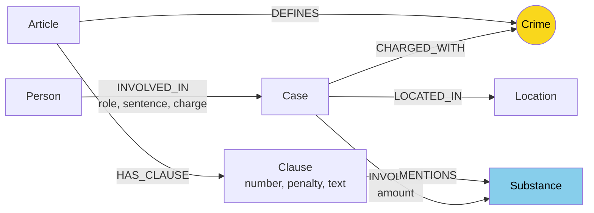

# Thiết kế Ontology — Day 19

**Họ tên:** Vũ Minh Trí  **MSSV:** 2A202602629

**Lựa chọn** (đánh dấu một):
- [x] Dùng ontology gợi ý (có thể chỉnh nhỏ)
- [ ] Tự thiết kế (xét bonus +15, xem `SUBMISSION.md`)

> Hướng dẫn: `LAB_GUIDE.md` Bước 2. Dùng ontology gợi ý thì vẫn phải điền đủ các mục dưới đây bằng lời của bạn.

## 1. Sơ đồ

Vẽ bằng mermaid. Node cầu nối chính giữa hai cơ sở tri thức (KB Luật và KB Tin tức) là **Crime** (và phụ trợ là **Substance**).

## 2. Entity types (node labels)

| Label | Ý nghĩa | Khóa định danh (`MERGE` theo) | Properties | Lấy từ KB nào | Trích bằng (regex / LLM / khác) |
| --- | --- | --- | --- | --- | --- |
| `Article` | Một Điều luật cụ thể trong văn bản luật | `id` (e.g. `"Điều 251 BLHS"`) | `id, title, law, doc_id` | Luật | regex (`parse_law_article`) |
| `Clause` | Khoản luật thuộc Điều, quy định khung hình phạt cụ thể | `id` (e.g. `"Điều 251 BLHS khoản 1"`) | `id, number, penalty, text, doc_id` | Luật | regex (`parse_law_article`) |
| `Crime` | Tội danh pháp lý chuẩn theo BLHS (node cầu nối) | `name` (chuẩn hóa chữ thường, bỏ "tội ") | `name` | Cả hai | Luật (regex tiêu đề), Tin tức (LLM + `link_entity`) |
| `Substance` | Tên chất ma túy hoặc tiền chất | `name` (chuẩn hóa danh mục) | `name` | Cả hai | Luật (regex từ vựng), Tin tức (LLM prompt) |
| `Case` | Vụ án / vụ việc cụ thể được báo chí phản ánh | `name` | `name, summary, date, doc_id, source_title` | Tin tức | LLM (`extract_news_cases`) |
| `Person` | Cá nhân liên quan (bị cáo, bị can, đối tượng) | `name` | `name, aliases` | Tin tức | LLM (`extract_news_cases`) |
| `Location` | Tỉnh/thành phố, địa bàn diễn ra vụ việc/xét xử | `name` | `name` | Tin tức | LLM (`extract_news_cases`) |

## 3. Relationships

| Type | Từ → Đến | Properties trên cạnh | Ý nghĩa |
| --- | --- | --- | --- |
| `DEFINES` | `Article` → `Crime` | Không có | Điều luật định nghĩa tội danh tương ứng |
| `HAS_CLAUSE` | `Article` → `Clause` | Không có | Điều luật bao gồm các khoản khung hình phạt cụ thể |
| `MENTIONS` | `Clause` → `Substance` | Không có | Khoản luật đề cập đến loại chất ma túy để xác định khung phạt |
| `CHARGED_WITH` | `Case` → `Crime` | Không có | Vụ án bị khởi tố / truy tố / xét xử về tội danh nào |
| `INVOLVES` | `Case` → `Substance` | `amount` | Vụ án liên quan đến chất ma túy nào và số lượng/khối lượng tang vật |
| `LOCATED_IN` | `Case` → `Location` | Không có | Địa bàn xảy ra vụ việc hoặc địa phương xét xử |
| `INVOLVED_IN` | `Person` → `Case` | `role, sentence, charge` | Người tham gia vào vụ án với vai trò, mức án bị tuyên và tội danh |

## 4. Node cầu nối giữa 2 KB

- **Node nào:** Node `Crime` (Tội danh) đóng vai trò cầu nối chính; ngoài ra `Substance` đóng vai trò cầu nối phụ trợ để đối chiếu khối lượng/tình tiết.
- **Vì sao chọn node này:** Tin tức báo chí luôn phản ánh một vụ án gắn với các tội danh cụ thể được khởi tố hoặc xét xử. Trong khi đó, văn bản luật (Bộ luật Hình sự) tổ chức từng Điều theo từng tội danh cụ thể. Do đó, `Crime` là điểm giao thoa ngữ nghĩa tự nhiên và chính xác nhất kết nối một vụ việc ngoài đời thực với quy định pháp luật.
- **Cách đảm bảo hai phía khớp tên:**
  - Chuẩn hóa chuỗi bằng hàm `normalize_crime`: chuyển chữ thường, loại bỏ tiền tố `"tội "`, dọn sạch khoảng trắng và dấu ngoặc kép.
  - Cung cấp danh sách tên tội danh chuẩn trích từ luật vào prompt của LLM khi đọc tin tức (`NEWS_EXTRACTION_PROMPT`).
  - Sử dụng hàm `link_entity` kết hợp so khớp chính xác và so khớp mờ (`difflib.get_close_matches` với `cutoff=0.8`) để xử lý sai lệch chính tả tiếng Việt (như "ma tuý" vs "ma túy").
- **Khi nào cầu gãy, và bạn xử lý thế nào:**
  - *Khi nào gãy:* Khi phóng viên dùng từ ngữ dân dã không đúng tên pháp lý (ví dụ: "chơi thuốc", "tuồn hàng trắng"), hoặc bài báo chỉ đưa tin điều tra ban đầu chưa công bố tội danh, hoặc LLM sinh ra tội danh không có trong BLHS.
  - *Xử lý:* `link_entity` sẽ trả về `None` chứ không map sai lệch; hệ thống GraphRAGAgent kết hợp cả Vector Search (Flat RAG) lẫn Graph Context (Hybrid RAG) để đảm bảo nếu cầu graph không đi được thì thông tin từ các chunk văn bản liên quan vẫn được cung cấp cho LLM.

## 5. Competency questions

Với mỗi câu trong `data/benchmark_kg.json`, ghi đường đi trên graph dùng để trả lời.

| Câu | Đường đi (Cypher pattern) | Trả lời được? |
| --- | --- | --- |
| Q1 | `(:Article {id: "Điều 2 Luật PCMT 2021"})-[:HAS_CLAUSE]->(:Clause)` hoặc trực tiếp từ chunking vector luật | Trả lời được (Single-hop luật) |
| Q2 | `(:Case)<-[:INVOLVED_IN {sentence: "tử hình"}]-(:Person)` | Trả lời được (Single-hop tin tức) |
| Q3 | `(:Person {name: "Lê Minh Thành"})-[:INVOLVED_IN]->(:Case)-[:CHARGED_WITH]->(:Crime)<-[:DEFINES]-(:Article)-[:HAS_CLAUSE]->(:Clause {number: 1})` | Trả lời được (Cross-KB: đi từ người vụ án sang Điều luật và khoản 1) |
| Q4 | `(:Person {name: "Dương Minh Tuấn"})-[:INVOLVED_IN]->(:Case)-[:CHARGED_WITH]->(:Crime)<-[:DEFINES]-(:Article)-[:HAS_CLAUSE]->(:Clause)` | Trả lời được (Cross-KB: đi từ người/biệt danh sang Điều 255 và các khung hình phạt) |
| Q5 | `(:Person {name: "Cái Quang Huy"})-[:INVOLVED_IN]->(k:Case)-[:CHARGED_WITH]->(:Crime)<-[:DEFINES]-(a:Article)-[:HAS_CLAUSE]->(cl:Clause)-[:MENTIONS]->(s:Substance {name: "MDMA"})` kết hợp `(k)-[r:INVOLVES]->(s)` | Trả lời được (Cross-KB multi-hop: khớp chất và đối chiếu khối lượng 9.6kg thuộc khoản 4) |
| Q6 | `(:Substance {name: "MDMA"})<-[:INVOLVES]-(k:Case)` cùng `(:Person)-[:INVOLVED_IN]->(k)` | Trả lời được (Aggregation: truy vết toàn bộ vụ án liên quan đến MDMA) |

## 6. Quyết định thiết kế và đánh đổi

1. **Trích xuất văn bản Luật bằng biểu thức chính quy (Regex) thay vì LLM:**
   - *Đã chọn:* Dùng regex xác định phân cấp `Điều`, `Khoản`, `Điểm` và trích xuất cấu trúc văn bản luật xác định.
   - *Phương án khác:* Gọi LLM để đọc từng Điều luật rồi sinh JSON.
   - *Lý do chọn:* Văn bản quy phạm pháp luật Việt Nam có cấu trúc rất chuẩn mực và đều đặn. Regex thực thi tức thời (< 0.1 giây), chi phí 0 USD, độ tin cậy 100%, không bị ảo giác hoặc sai lệch định dạng.

2. **Khóa định danh của `Clause` gắn kèm `article_id`:**
   - *Đã chọn:* Định danh `Clause` dưới dạng `f"{article_id} khoản {number}"` (ví dụ: `"Điều 251 BLHS khoản 1"`).
   - *Phương án khác:* Dùng số thứ tự khoản đơn thuần (`number: 1, 2...`) hoặc hash ngẫu nhiên.
   - *Lý do chọn:* Số thứ tự khoản lặp lại ở mọi Điều luật. Kết hợp `article_id` tạo thành một khóa tự nhiên, duy nhất trên toàn bộ Knowledge Graph, thuận tiện cho việc thiết lập ràng buộc duy nhất (`CONSTRAINT IS UNIQUE`) và dễ dàng truy vấn/đọc log.

3. **Lưu trữ thông tin tố tụng (vai trò, hình phạt) trên quan hệ `INVOLVED_IN`:**
   - *Đã chọn:* Đặt `role`, `sentence`, `charge` làm properties trên cạnh `[:INVOLVED_IN]` nối giữa `Person` và `Case`.
   - *Phương án khác:* Tạo một node trung gian riêng như `Sentence` (Mức án) hoặc `Verdict` (Bản án).
   - *Lý do chọn:* Giúp đồ thị gọn gàng, giảm số lượng node và độ phức tạp khi traversal. Mức án là thông tin mang tính ngữ cảnh giữa một cá nhân cụ thể và một vụ án cụ thể (một người có thể phạm nhiều tội trong nhiều vụ án với các mức án khác nhau).

## 7. So với ontology gợi ý (bắt buộc nếu xét bonus)

| Điểm khác | Gợi ý làm gì | Bạn làm gì | Vấn đề nó giải quyết | Bằng chứng (Cypher, hoặc số liệu benchmark) |
| --- | --- | --- | --- | --- |
| *Không áp dụng* | Dùng ontology gợi ý | Sử dụng ontology gợi ý chuẩn | Giữ thiết kế chuẩn mực, tập trung tối ưu hóa chất lượng truy vấn multi-hop và phân tích | Hoàn thành theo chuẩn bài lab |

## 8. Hạn chế còn lại

- **Định danh `Case` và `Person` dựa trên tên:** Nếu bài báo viết tên tắt (ví dụ "Nguyễn Văn A.") hoặc LLM tóm tắt tên vụ án theo nhiều cách khác nhau giữa các bài viết về cùng một vụ, đồ thị sẽ tạo ra nhiều node `Case`/`Person` trùng lặp trong thực tế.
- **Chưa số hóa định lượng khối lượng tang vật:** Ngưỡng khối lượng ma túy trong các điểm/khoản luật vẫn nằm ở dạng văn bản tiếng Việt trong thuộc tính `Clause.text`, chưa được parse thành dải số học `[min_amount, max_amount]` kèm đơn vị (`gam`, `kg`), do đó việc so khớp mức án theo khối lượng vẫn cần LLM đọc văn bản khoản luật ở khâu trả lời.
